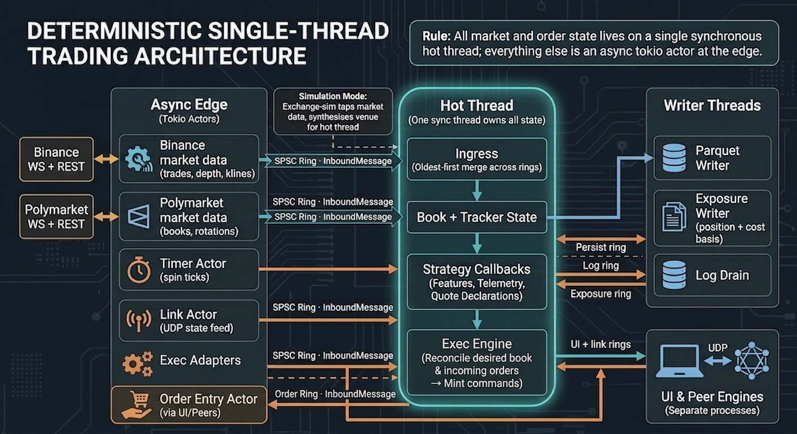
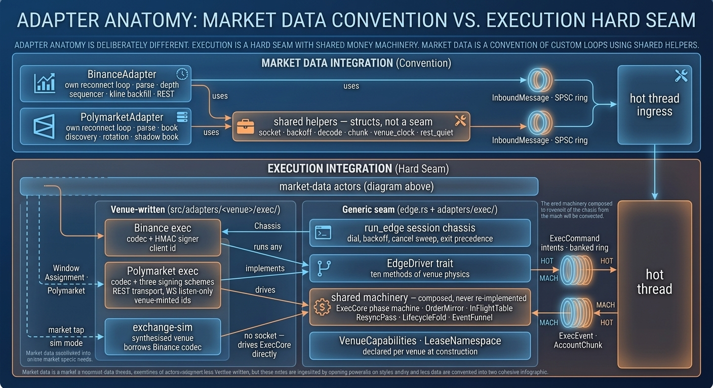

# polysim

A toy market making educational and visualisation tool for live simulation and data collection of running spike tests on market making strategies.

Yes, you can also execute live trades, but this is not the purpose of this tool.

This project is part of a personal project and experiment to see how high of code quality can be written when applying the right skills via the `rex-skills` cargo install.

Whether you are an engineer, hobbyist, student or whatever, the idea is that with cutting edge LLMs you have a foundation to learn from and work with.

The project is NOT optimised for latency. It is rather optimised for adaptability, whereby exchanges are popped on and off easily as adapters. The project uses a generic structure described below to help ensure any type of exchange could be bolted on. Right now the library does not support FIX although if time permits, will work on that perhaps in the future.

Note that live trading is untested and just there for now as a placeholder. This repo is NOT meant for live trading execution so please use at your own risk.

## Run

```shell
# Credentials — copy the template, then fill it in. .env is never tracked.
mv .env.example .env

# Trading engines — headless, one process per data source
cargo run --release --bin strat-micro-recorder-te-binance-spot-btcusdt
cargo run --release --bin strat-micro-recorder-te-polymarket-btc-updown-5m

# Desktop workstation — attaches to running engines over UDP, needs the `ui` feature.
cargo run --release --features ui --bin polysim-ui -- --strategy strat-micro-recorder --link 127.0.0.1:9310
cargo run --release --features ui --bin polysim-ui -- --strategy strat-micro-recorder --link 127.0.0.1:9311

# Gate — all five must pass before anything merges
cargo fmt --check
cargo clippy --all-targets -- -D warnings
cargo clippy --all-targets --features ui -- -D warnings
cargo test
cargo test --features ui

# ARM64 Linux binary for deployment, built in Docker, lands in dist/
./scripts/build-strategy.sh strat-micro-recorder-te-binance-spot-btcusdt

# ...which is a name check plus this. Run it directly if you prefer:
docker buildx build \
    --platform linux/arm64 \
    --build-arg BIN=strat-micro-recorder-te-binance-spot-btcusdt \
    --output type=local,dest=dist \
    .
```

## Post Trade Analysis

Post-trade analysis lives in [`strategies/post-trade.ipynb`](strategies/post-trade.ipynb), reading the parquet a run records. The Python environment is managed by [uv](https://docs.astral.sh/uv/) and lives in `strategies/` beside its `pyproject.toml`:

```shell
cd strategies

# One-off: create .venv (Python >= 3.12), then install from uv.lock
uv venv
uv sync
```

Open the notebook with `strategies/.venv` selected as the kernel — `ipykernel` is already in the environment.

Go ahead and select you jupyter notebook and start analysing data.

## Live Tests

Live-network tests are `#[ignore]`d and never run in CI:

```shell
cargo test --test integration -- --ignored --nocapture --skip poly_exec
```

## Architecture

Here is a general high level view of how everything connects together.



How it actually works: one thread — a single line of execution on one core — owns the entire picture of the market and our orders, and nothing else is ever allowed to touch that picture. Around it sit small helpers: one per exchange connection, translating whatever Binance or Polymarket send into simple fixed-size messages and dropping them onto queues; even the clock is just a helper posting a tick message a few times a second. The main thread loops forever: take the oldest waiting message, update the picture, let the strategy react, decide which orders it now wants. It never talks to an exchange itself — it queues "place this, cancel that" instructions for a helper to send, and the exchange's answers (accepted, filled, rejected) come back as ordinary messages like everything else. Writing files happens on separate threads, fed the same way, so the main loop never waits on a disk or the network. Because only one thread touches the state, there are no locks and no race conditions; and because the state changes only in response to messages, in order, recording those messages and replaying them later reproduces the run exactly — which is what makes the simulations and the collected data trustworthy.

### Adapter Anatomy



Plugging in an exchange means writing two pieces, and they are deliberately not the same shape. The market-data piece is the easy half: every exchange gets its own small translator that connects, listens, and turns whatever that exchange broadcasts into the engine's one common message format. The translators share a toolbox — opening connections, retrying after a disconnect, parsing prices exactly — but each writes its own loop, because exchanges differ too much for a template to help. The order-sending piece is the strict half, because mistakes here cost money. Everything dangerous is shared code, written once: remembering which orders are alive, what to do when the connection drops mid-order, never sending the same order twice, cancelling everything on the way out. A new exchange only writes the translation — how to format, sign and send requests that venue understands, and how to read its replies — plus a short declaration of the venue's quirks: its fees, its rate limits, how its markets behave. The simulator slots into that same socket: it pretends to be the exchange, drives the same shared machinery, and the trading thread genuinely cannot tell the difference.

The order-sending half is governed by a written contract — every promise a venue integration must keep, and exactly what you would have to write to add the next exchange, lives in [`src/adapters/exec/README.md`](src/adapters/exec/README.md).
